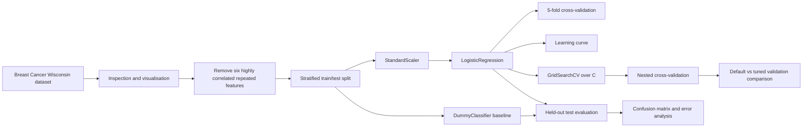
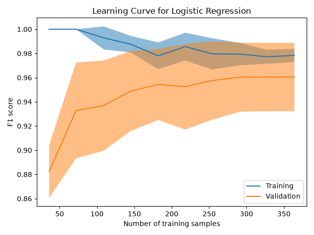
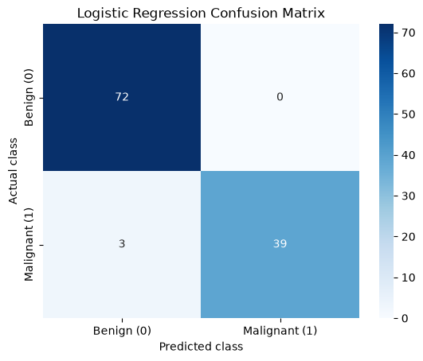

# Breast Cancer Wisconsin Classification

An end-to-end binary classification project using scikit-learn and the Breast Cancer Wisconsin Diagnostic dataset.

The project compares a majority-class baseline with a standardised logistic regression pipeline using cross-validation, held-out test evaluation, a confusion matrix and targeted error analysis.

A controlled extension additionally examines model learning behaviour and evaluates whether limited tuning of logistic regression regularisation improves estimated generalisation performance.

## Project overview

The objective is to predict whether a tumour sample is malignant or benign from numerical measurements derived from digitised images of breast mass cell nuclei.

The workflow includes:

- dataset inspection and visualisation;
- review of highly correlated measurements;
- removal of six repeated radius and perimeter features;
- stratified train/test splitting;
- majority-class baseline modelling;
- numerical scaling with `StandardScaler`;
- logistic regression using a scikit-learn `Pipeline`;
- five-fold cross-validation;
- held-out test evaluation;
- coefficient review and targeted error analysis;
- learning-curve analysis;
- limited tuning of logistic regression L2 regularisation;
- nested cross-validation of the tuning procedure;
- comparison of default and tuned validation performance;
- discussion of limitations.

The project is intentionally bounded. It does not attempt exhaustive model optimisation or establish clinical utility.

## Dataset

The project uses the Breast Cancer Wisconsin Diagnostic dataset included with scikit-learn.

The dataset contains:

- 569 samples;
- 30 numerical features;
- two target classes: malignant and benign.

Scikit-learn originally encodes malignant as `0` and benign as `1`. For this project, the target is remapped so that:

```text
0 = benign
1 = malignant
```

This makes malignant the positive class used by the binary classification metrics.

```python
from sklearn.datasets import load_breast_cancer

data = load_breast_cancer(as_frame=True)
df = data.frame.copy()

df["target"] = df["target"].map({0: 1, 1: 0})
```

Dataset documentation: [scikit-learn Breast Cancer Wisconsin dataset](https://scikit-learn.org/stable/modules/generated/sklearn.datasets.load_breast_cancer.html)

## Machine-learning task

- **Task:** supervised binary classification
- **Features:** numerical measurements for each sample
- **Target:** benign (`0`) or malignant (`1`)
- **Positive class:** malignant (`1`)
- **Baseline:** `DummyClassifier` using the majority class
- **Primary model:** logistic regression
- **Preprocessing:** standardisation with `StandardScaler`

The scaler and classifier are combined in a scikit-learn `Pipeline`, ensuring that preprocessing is fitted using the training data and applied consistently during cross-validation and testing.

## Workflow



The notebook follows this sequence:

1. Load and inspect the dataset.
2. Confirm feature types, target labels, missing values and class distribution.
3. Review correlations and visualise selected feature groups.
4. Remove six strongly correlated radius and perimeter measurements.
5. Split the data into stratified training and test sets.
6. Train and evaluate a majority-class baseline.
7. Build a `StandardScaler` and `LogisticRegression` pipeline.
8. Evaluate the default pipeline using five-fold cross-validation on the training data.
9. Fit the default pipeline and generate predictions for the held-out test set.
10. Compare the model with the majority-class baseline.
11. Interpret the confusion matrix and inspect misclassified samples.
12. Generate a learning curve using the training data.
13. Perform a limited search over logistic regression `C`.
14. Evaluate the tuning procedure using nested cross-validation.
15. Compare default and tuned validation performance.
16. Determine whether tuning materially improves estimated generalisation performance.

## Results

### Default five-fold cross-validation

The default logistic regression pipeline uses the scikit-learn default regularisation strength of `C=1`.

Five-fold cross-validation was performed using the training split only.

| Metric | Mean score | Standard deviation |
|---|---:|---:|
| Accuracy | 0.9714 | 0.0204 |
| Precision | 0.9822 | 0.0241 |
| Recall | 0.9412 | 0.0492 |
| F1 | 0.9604 | 0.0283 |

The default model therefore achieved strong and relatively consistent validation performance before any hyperparameter tuning.

## Controlled extension

The original workflow was extended after completing additional material on model selection, learning curves, hyperparameter tuning, linear models and regularisation.

The extension was deliberately restricted to:

- one learning curve;
- limited tuning of logistic regression `C`;
- nested cross-validation of the tuning procedure;
- comparison of default and tuned validation performance.

The held-out test set was not used for learning-curve analysis or hyperparameter selection.

### Learning curve

The learning curve evaluates how training and validation F1 change as progressively larger portions of the available training data are used.



At small training sizes, training F1 was close to 1.0 while validation F1 was substantially lower, indicating high variance and overfitting when very little data was available.

As training size increased:

- training F1 decreased slightly;
- validation F1 improved;
- the train-validation gap narrowed substantially.

At the largest training sizes:

- training F1 was approximately 0.98;
- validation F1 was approximately 0.96;
- the remaining generalisation gap was small;
- both curves began to flatten.

Validation F1 plateaued at approximately 0.96 from around 291 training samples onward.

This provides little evidence of substantial underfitting or overfitting at the full available training size and suggests diminishing returns from additional samples for the current logistic regression pipeline within the observed range.

Validation scores showed greater fold-to-fold variability than training scores, reflecting some sensitivity to the particular held-out validation samples in this relatively small dataset.

### Regularisation tuning

Logistic regression uses L2 regularisation by default.

The hyperparameter `C` controls the inverse regularisation strength:

```text
smaller C
→ stronger regularisation

larger C
→ weaker regularisation
```

A deliberately small logarithmic search space was evaluated:

```python
C_values = [0.001, 0.01, 0.1, 1, 10, 100, 1000]
```

The search used `GridSearchCV` with five-fold cross-validation and malignant-class F1 as the optimisation metric.

| C | Mean CV F1 | Standard deviation | Rank |
|---:|---:|---:|---:|
| 0.001 | 0.7313 | 0.1021 | 7 |
| 0.010 | 0.9209 | 0.0333 | 6 |
| 0.100 | 0.9476 | 0.0321 | 5 |
| 1 | 0.9604 | 0.0283 | 4 |
| **10** | **0.9671** | **0.0174** | **1** |
| 100 | 0.9642 | 0.0121 | 2 |
| 1000 | 0.9641 | 0.0183 | 3 |

When `GridSearchCV` was fitted to the complete training split, the highest mean CV F1 was obtained with:

```text
C = 10
```

Very strong regularisation substantially reduced validation performance, while moderate-to-weak regularisation performed considerably better.

Within the outer folds of nested cross-validation, the selected `C` values varied between `1`, `10` and `100`. This indicates some sensitivity of the exact optimum to resampling, without evidence that one precise value is consistently superior.

### Default vs tuned validation performance

Nested cross-validation was used to evaluate the complete tuning procedure.

Within each outer training fold, an inner `GridSearchCV` selected the best value of `C`. The resulting model was then evaluated on the untouched outer validation fold.

This separates hyperparameter selection from the data used to estimate the performance of the tuning procedure.

| Metric | Default mean | Default SD | Tuned mean | Tuned SD |
|---|---:|---:|---:|---:|
| Accuracy | 0.9714 | 0.0204 | 0.9714 | 0.0149 |
| Precision | 0.9822 | 0.0241 | 0.9822 | 0.0241 |
| Recall | 0.9412 | 0.0492 | 0.9412 | 0.0322 |
| F1 | 0.9604 | 0.0283 | 0.9608 | 0.0204 |

Although `C=10` produced the highest mean F1 during the search fitted to the complete training set, the nested cross-validation results showed essentially unchanged estimated generalisation performance.

Mean F1 increased only from:

```text
0.9604 → 0.9608
```

This difference is negligible relative to the observed cross-validation variability.

Limited regularisation tuning therefore did not materially improve estimated generalisation performance.

The default logistic regression configuration was retained as the primary model.

Further hyperparameter searches, complex feature engineering and additional model comparisons were intentionally excluded from this controlled extension.

### Held-out test performance

The held-out test results below correspond to the retained default logistic regression pipeline.

| Model | Accuracy | Precision | Recall | F1 |
|---|---:|---:|---:|---:|
| Dummy baseline | 0.6316 | 0.0000 | 0.0000 | 0.0000 |
| Logistic regression | 0.9737 | 1.0000 | 0.9286 | 0.9630 |

The logistic regression pipeline substantially outperformed the majority-class baseline.

On the held-out test set, it correctly classified all 72 benign samples and 39 of 42 malignant samples.



The confusion matrix contained:

- 72 true negatives;
- 0 false positives;
- 3 false negatives;
- 39 true positives.

All three errors were malignant samples predicted as benign.

Their selected measurements were closer to the benign feature averages than the malignant averages within the test set, although this descriptive review does not establish that any individual feature caused the errors.

## Main findings

The project produced four main findings:

1. The standardised logistic regression pipeline substantially outperformed the majority-class baseline.
2. Five-fold cross-validation showed strong default-model performance with an F1 of approximately 0.96.
3. The learning curve showed that overfitting at very small training sizes diminished as more samples were added, with training and validation performance becoming high and relatively close.
4. Limited regularisation tuning selected `C=10` on the complete training split, but nested cross-validation showed no material performance improvement compared with the default `C=1`.

The controlled extension therefore supported retaining the simpler default logistic regression configuration rather than continuing to optimise a model that already showed strong validation performance.

## Repository structure

```text
breast-cancer-ml-workflow/
├── README.md
├── PROJECT_PLAN.md
├── breast_cancer_workflow.ipynb
├── confusion_matrix.png
├── learning_curve.png
├── requirements.txt
└── .gitignore
```

- `README.md` — project overview, methodology, results and conclusions.
- `PROJECT_PLAN.md` — implementation plan, learning objectives and project scope.
- `breast_cancer_workflow.ipynb` — complete analysis, modelling and controlled extension workflow.
- `confusion_matrix.png` — held-out test-set confusion matrix.
- `learning_curve.png` — training and validation F1 across increasing training-set sizes.
- `requirements.txt` — Python dependencies.
- `.gitignore` — excluded local and generated files.

## Installation

Clone the repository:

```bash
git clone <repository-url>
cd breast-cancer-ml-workflow
```

Create and activate a virtual environment.

### macOS or Linux

```bash
python3 -m venv .venv
source .venv/bin/activate
```

### Windows PowerShell

```powershell
python -m venv .venv
.venv\Scripts\Activate.ps1
```

Install the dependencies:

```bash
python -m pip install --upgrade pip
pip install -r requirements.txt
```

## Usage

Open the notebook:

```bash
jupyter notebook breast_cancer_workflow.ipynb
```

Run the notebook from top to bottom to reproduce the analysis, model evaluation, learning curve and regularisation-tuning extension.

## Limitations

This project uses a relatively small historical dataset from a single source. Five-fold cross-validation provides a more stable estimate of model performance on the training data, but the final held-out result still comes from one test split.

The learning curve suggests that validation performance begins to plateau within the available training-size range, but this does not prove that substantially more or more diverse data could not improve performance.

Hyperparameter tuning was deliberately limited to the logistic regression regularisation strength `C`. The project does not attempt exhaustive optimisation and does not establish that logistic regression is the optimal model family.

The model has not undergone:

- external validation;
- prospective validation;
- probability calibration;
- classification-threshold optimisation;
- subgroup performance assessment;
- clinical workflow testing;
- clinical safety evaluation.

Its performance on this dataset does not establish generalisation across institutions, populations, imaging systems or real diagnostic environments.

The error analysis is descriptive and does not establish causal relationships between individual measurements and model errors.

The model is not intended for diagnosis, screening, treatment decisions or other clinical use.

## Conclusion

The project demonstrates a complete and deliberately bounded supervised binary-classification workflow using scikit-learn.

A majority-class baseline was compared with a standardised logistic regression pipeline using cross-validation and an untouched held-out test set. The logistic regression model substantially outperformed the baseline and achieved strong validation and held-out performance.

The controlled extension applied learning-curve analysis and limited regularisation tuning without introducing additional model families or complex feature engineering.

The learning curve showed that the train-validation gap narrowed as more data became available and that validation F1 plateaued at approximately 0.96.

Although `GridSearchCV` selected `C=10` on the complete training set, nested cross-validation showed essentially no improvement over the default `C=1` configuration. The default logistic regression pipeline was therefore retained.

The project demonstrates correct preprocessing, cross-validation, held-out evaluation, error analysis, learning-curve interpretation and bounded hyperparameter tuning while maintaining explicit limitations around clinical generalisation and use.

## References

- [Scikit-learn Breast Cancer Wisconsin dataset](https://scikit-learn.org/stable/modules/generated/sklearn.datasets.load_breast_cancer.html)
- [Scikit-learn documentation](https://scikit-learn.org/stable/)
- [Scikit-learn MOOC](https://inria.github.io/scikit-learn-mooc/)