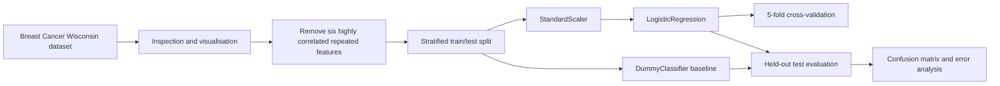

# Breast Cancer Wisconsin Classification

An end-to-end binary classification project using scikit-learn and the Breast Cancer Wisconsin Diagnostic dataset.

The project compares a majority-class baseline with a logistic regression pipeline and evaluates performance using cross-validation, held-out test metrics, a confusion matrix and targeted error analysis.

## Project overview

The objective is to predict whether a tumour sample is malignant or benign from numerical measurements derived from digitised images of breast mass cell nuclei.

The workflow includes:

- dataset inspection and visualisation;
- review of highly correlated measurements;
- removal of six repeated radius and perimeter features;
- stratified train/test splitting;
- majority-class baseline modelling;
- numerical scaling with `StandardScaler`;
- logistic regression using a scikit-learn `Pipeline`;
- five-fold cross-validation;
- held-out test evaluation;
- coefficient review and error analysis;
- discussion of limitations.

## Dataset

The project uses the Breast Cancer Wisconsin Diagnostic dataset included with scikit-learn.

The dataset contains:

- 569 samples;
- 30 numerical features;
- two target classes: malignant and benign.

Scikit-learn originally encodes malignant as `0` and benign as `1`. For this project, the target is remapped so that:

```text
0 = benign
1 = malignant
```

This makes malignant the positive class used by the binary classification metrics.

```python
from sklearn.datasets import load_breast_cancer

data = load_breast_cancer(as_frame=True)
df = data.frame.copy()
df["target"] = df["target"].map({0: 1, 1: 0})
```

Dataset documentation: [scikit-learn Breast Cancer Wisconsin dataset](https://scikit-learn.org/stable/modules/generated/sklearn.datasets.load_breast_cancer.html)

## Machine-learning task

- **Task:** supervised binary classification
- **Features:** numerical measurements for each sample
- **Target:** benign (`0`) or malignant (`1`)
- **Positive class:** malignant (`1`)
- **Baseline:** `DummyClassifier` using the majority class
- **Primary model:** logistic regression
- **Preprocessing:** standardisation with `StandardScaler`

The scaler and classifier are combined in a scikit-learn `Pipeline`, ensuring that preprocessing is fitted using the training data and applied consistently during validation and testing.

## Workflow



The notebook follows this sequence:

1. Load and inspect the dataset.
2. Confirm feature types, target labels, missing values and class distribution.
3. Review correlations and visualise selected feature groups.
4. Remove six strongly correlated radius and perimeter measurements.
5. Split the data into stratified training and test sets.
6. Train and evaluate a majority-class baseline.
7. Build a `StandardScaler` and `LogisticRegression` pipeline.
8. Evaluate the pipeline using five-fold cross-validation on the training data.
9. Fit the pipeline and generate predictions for the held-out test set.
10. Compare the model with the baseline.
11. Interpret the confusion matrix and inspect misclassified samples.

## Results

### Five-fold cross-validation

| Metric | Mean score |
|---|---:|
| Accuracy | 0.9714 |
| Precision | 0.9822 |
| Recall | 0.9412 |
| F1 | 0.9604 |

### Held-out test performance

| Model | Accuracy | Precision | Recall | F1 |
|---|---:|---:|---:|---:|
| Dummy baseline | 0.6316 | 0.0000 | 0.0000 | 0.0000 |
| Logistic regression | 0.9737 | 1.0000 | 0.9286 | 0.9630 |

The logistic regression pipeline substantially outperformed the majority-class baseline. On the held-out test set, it correctly classified all 72 benign samples and 39 of 42 malignant samples.

The confusion matrix contained:

- 72 true negatives;
- 0 false positives;
- 3 false negatives;
- 39 true positives.

All three errors were malignant samples predicted as benign. Their selected measurements were closer to the benign feature averages than the malignant averages within the test set, although this descriptive review does not establish that any individual feature caused the errors.

## Repository structure

```text
breast-cancer-ml-workflow/
├── README.md
├── PROJECT_PLAN.md
├── breast_cancer_workflow.ipynb
├── requirements.txt
└── .gitignore
```

- `README.md` — project overview, methodology, setup and results.
- `PROJECT_PLAN.md` — implementation plan, learning objectives and project scope.
- `breast_cancer_workflow.ipynb` — complete analysis and modelling workflow.
- `requirements.txt` — Python dependencies.
- `.gitignore` — excluded local and generated files.

## Installation

Clone the repository:

```bash
git clone <repository-url>
cd breast-cancer-ml-workflow
```

Create and activate a virtual environment.

macOS or Linux:

```bash
python3 -m venv .venv
source .venv/bin/activate
```

Windows PowerShell:

```powershell
python -m venv .venv
.venv\Scripts\Activate.ps1
```

Install the dependencies:

```bash
python -m pip install --upgrade pip
pip install -r requirements.txt
```

## Usage

Open the notebook:

```bash
jupyter notebook breast_cancer_workflow.ipynb
```

Run the notebook from top to bottom to reproduce the analysis and model evaluation.

## Limitations

This project uses a relatively small historical dataset from a single source. Five-fold cross-validation provides a more stable estimate on the training data, but the final result is still based on one held-out test split.

The model has not undergone external or prospective validation, probability calibration, threshold selection, subgroup assessment, workflow testing or clinical safety evaluation. Its performance on this dataset does not establish generalisation across institutions, populations, imaging systems or real diagnostic environments.

The model is not intended for diagnosis, screening, treatment decisions or other clinical use.

## References

- [Scikit-learn Breast Cancer Wisconsin dataset](https://scikit-learn.org/stable/modules/generated/sklearn.datasets.load_breast_cancer.html)
- [Scikit-learn documentation](https://scikit-learn.org/stable/)
- [Scikit-learn MOOC](https://inria.github.io/scikit-learn-mooc/)
